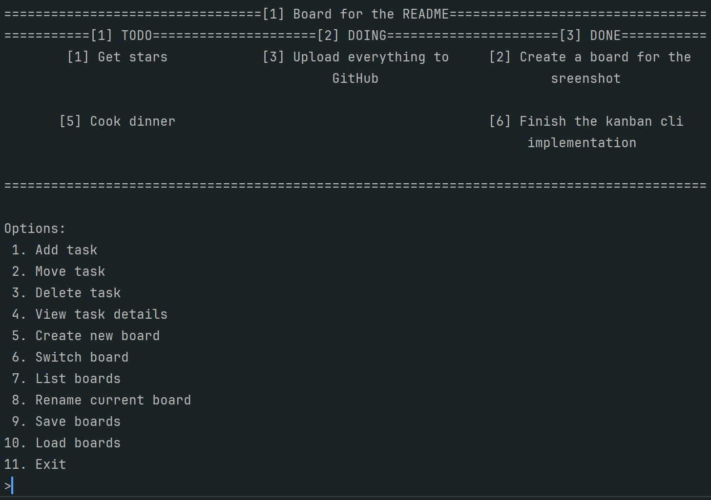

# Kanban CLI Board Manager



A terminal-based Kanban board implementation in C++. Features persistent storage, automatic ID generation, and multi-board support.

## Features
- **Multi-board management**: Create and switch between multiple boards
- **Persistent storage**: Automatically saves to `kanban_boards.txt`
- **Automatic ID generation**: Unique IDs for all boards and tasks
- **Task operations**: Add, move, delete, and view tasks with descriptions
- **Intuitive interface**: Numeric menu system with column-based display

## Requirements
- C++17 compatible compiler
- CMake 3.20+

## Building and Running
```bash
# Clone repository
git clone https://github.com/furby73/kanbancli.git
cd kanbancli

# Configure and build
mkdir build && cd build
cmake .. && make

# Run application
./kanban_cli_board
